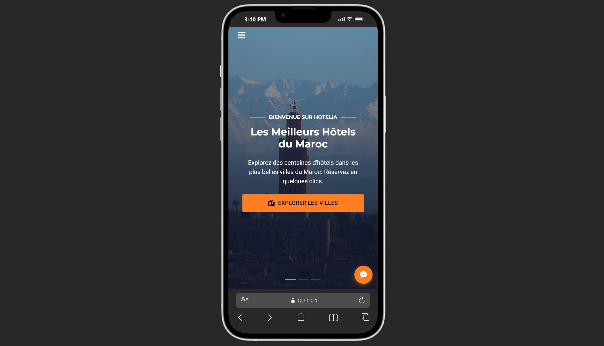
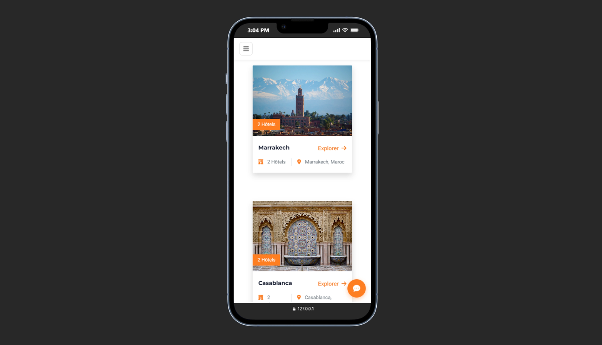
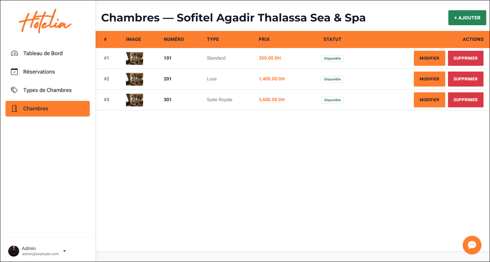
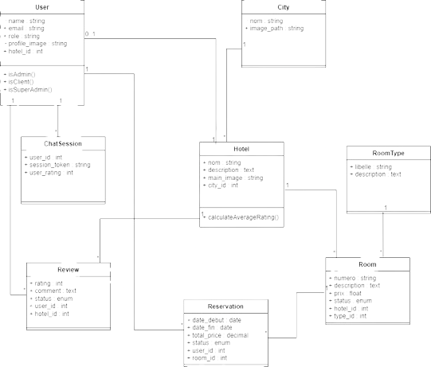
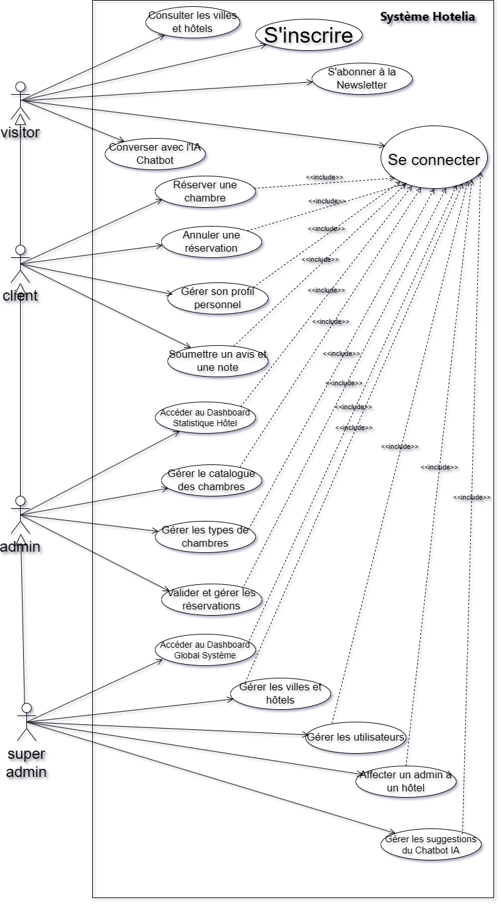

<p align="center">
  <a href="https://laravel.com" target="_blank">
    
  </a>
</p>

<p align="center">
  
  
  
  
  
</p>

---

# 🏨 Hotelia — Intelligent Hotel Management System

> A modern, highly responsive, and AI-powered **Hotel Management SaaS** built with **Laravel 12**.  
> Designed for real-world hotel operations — from seamless client bookings to a premium, mobile-first admin experience with a live AI Chatbot assistant.

---

## 📋 Table of Contents

- [About the Project](#-about-the-project)
- [Key Features](#-key-features)
- [Technology Stack](#-technology-stack)
- [System Architecture](#-system-architecture)
- [Screenshots](#-demo--screenshots)
- [Installation & Setup](#️-installation--setup)
- [Default Test Accounts](#-default-test-accounts)
- [Database & ER Diagram](#️-database--er-diagram)
- [AI Chatbot Architecture](#-ai-chatbot-architecture)
- [Folder Structure](#-folder-structure)
- [Contributing](#-contributing)
- [License](#-license)

---

## 🌟 About the Project

**Hotelia** is a full-featured, production-ready Hotel Management System that handles the complete lifecycle of hotel operations. Clients can browse rooms, check real-time availability by date range, and complete secure reservations — all from a beautifully crafted, mobile-optimized interface.

On the administrative side, a premium multi-role dashboard empowers hotel staff with full control over room management, booking tracking, and hospitality packages. The centerpiece of the admin experience is an **integrated AI Chatbot** that understands natural language queries and retrieves live data directly from the SQL database — eliminating the need to manually navigate tables for quick answers.

Whether you're a solo hotel owner or managing a chain of properties, Hotelia delivers the tools you need with an interface your staff will love.

---

## 🚀 Key Features

### 🏢 Super Admin Panel

| Feature | Description |
|---|---|
| 🔑 **Full System Control** | Access to every hotel, every admin, every booking across the system |
| 👥 **Admin Management** | Create, edit, suspend, and delete hotel admin accounts |
| 📊 **System-Wide Analytics** | Overview statistics of all properties and reservations |
| 🤖 **AI Chatbot Access** | Query any data across the entire platform via natural language |
| ⚙️ **Global Settings** | Configure system-wide parameters and defaults |

### 🏠 Admin Panel (Hotel Manager)

| Feature | Description |
|---|---|
| 🛏️ **Room Management** | Full CRUD for rooms — add, edit, delete, toggle visibility (visible/hidden) |
| 📅 **Booking Management** | View, confirm, cancel, and track all guest reservations |
| 🎁 **Hospitality Packages** | Create and manage special packages, offers, and services |
| 🤖 **AI Chatbot Assistant** | Ask the chatbot real-time questions like *"How many bookings do we have this week?"* |
| 📱 **Mobile-First UI** | Tables transform into elegant touch-friendly cards on mobile |
| 🎨 **Premium Design** | Cinematic loading screens, animated sidebar drawers, and polished aesthetics |

### 👤 Client (Guest) Side

| Feature | Description |
|---|---|
| 🔍 **Availability Search** | Filter rooms by check-in and check-out dates in real time |
| 🛒 **Booking Flow** | Streamlined, secure multi-step room reservation process |
| 📋 **My Bookings Portal** | Personal dashboard to view, track, and manage reservations |
| 👤 **Profile Management** | Update personal information with full input validation |
| 📧 **Booking Confirmation** | Instant confirmation details upon successful reservation |

### 🤖 AI Chatbot Highlights

- **Intent Routing Engine** — Understands hotel-specific intents and maps them to database queries
- **Real-Time SQL Querying** — Retrieves live data (availability, bookings, revenue) on demand
- **Fallback Local Engine** — Gracefully handles unrecognized queries with intelligent fallback responses
- **Context-Aware Replies** — Tailored responses based on the authenticated user's role and hotel context
- **Natural Language Interface** — Staff interact in plain language, no SQL or navigation required

---

## 🛠 Technology Stack

### Backend
- **Framework:** Laravel 12
- **Language:** PHP 8.2+
- **ORM:** Eloquent ORM
- **Authentication:** Laravel Session-Based Auth (multi-guard, multi-role)
- **Database:** MySQL 8.0
- **Migrations & Seeders:** Full schema with test data population

### Frontend
- **Templating:** Laravel Blade Templates
- **Markup:** HTML5 (semantic structure)
- **Styling:** Vanilla CSS with a custom Design System (no external CSS frameworks)
- **Scripting:** Vanilla JavaScript (DOM manipulation, fetch API, animations)
- **Responsive Design:** Mobile-First approach — table-to-card transformation pattern

### AI & Intelligence Layer
- **Architecture:** Custom Intent-Routing Engine (built in PHP/Laravel)
- **Query Engine:** Direct Eloquent/SQL database querying based on parsed intents
- **Fallback System:** Local rule-based engine for unmatched queries
- **Interface:** AJAX-powered real-time chat UI embedded in the admin panel

### Infrastructure & Tooling
- **Package Manager (PHP):** Composer
- **Package Manager (JS):** NPM
- **Build Tool:** Vite (Laravel default)
- **Version Control:** Git

---

## 🏗 System Architecture

```
Hotelia
├── 🌐 Public (Client) Layer
│   ├── Room browsing & availability filtering
│   ├── Secure booking flow
│   └── Personal reservations portal
│
├── 🔐 Multi-Role Auth System
│   ├── Super Admin Guard
│   ├── Admin Guard
│   └── User (Client) Guard
│
├── 🖥️ Admin Layer
│   ├── Room CRUD & visibility management
│   ├── Booking & hospitality management
│   └── AI Chatbot interface
│
├── 👑 Super Admin Layer
│   ├── System-wide management
│   ├── Hotel admin account control
│   └── Global analytics dashboard
│
└── 🤖 AI Engine Layer
    ├── Intent parser
    ├── SQL query dispatcher
    └── Fallback response engine
```

---

## 📸 Demo & Screenshots

### 📱 Mobile UI (100% Responsive)

**Mobile Home Page — "Les Meilleurs Hôtels du Maroc"**


**Mobile Cities View**


### 🖥️ Admin Dashboard (Desktop)

**Interface: Créer une Chambre (Room Creation)**


---

## ⚙️ Installation & Setup

Follow these steps to run Hotelia locally on your machine from scratch.

### Prerequisites

Make sure the following are installed on your system before proceeding:

- PHP **8.2** or higher
- Composer **2.x**
- Node.js **18+** and NPM
- MySQL **8.0+**
- Git

---

### Step 1 — Clone the Repository

```bash
git clone https://github.com/your-username/hotelManagement.git
cd hotelManagement
```

---

### Step 2 — Configure Environment Variables

Copy the example environment file and open it for editing:

```bash
cp .env.example .env
```

Open the `.env` file and update the following values with your local database credentials:

```dotenv
APP_NAME=Hotelia
APP_ENV=local
APP_DEBUG=true
APP_URL=http://127.0.0.1:8000

DB_CONNECTION=mysql
DB_HOST=127.0.0.1
DB_PORT=3306
DB_DATABASE=hotelia_db       # ← Change to your database name
DB_USERNAME=root              # ← Change to your MySQL username
DB_PASSWORD=your_password     # ← Change to your MySQL password
```

> ⚠️ Make sure the database (`hotelia_db` or your chosen name) **already exists** in MySQL before running migrations.

---

### Step 3 — Install PHP Dependencies

```bash
composer install
```

---

### Step 4 — Install Frontend Dependencies & Build Assets

```bash
npm install
npm run build
```

> For active development with hot-reload, use `npm run dev` instead of `npm run build`.

---

### Step 5 — Generate Application Key

```bash
php artisan key:generate
```

---

### Step 6 — Run Database Migrations & Seeders

This command will create all the required database tables (including custom session tables) and populate them with demo/test data:

```bash
php artisan migrate --seed
```

> 💡 To reset and re-seed from scratch at any time, run: `php artisan migrate:fresh --seed`

---

### Step 7 — Start the Development Server

```bash
php artisan serve
```

Your application is now live at: **http://127.0.0.1:8000** 🎉

---

## 🔐 Default Test Accounts

The database seeders automatically create the following accounts for testing all portals:

### 👑 Super Admin Account
| Field | Value |
|---|---|
| **Email** | `superadmin@gmail.com` |
| **Password** | `Password@1` |
| **Access** | Full system control — all hotels, all admins, all bookings |

### 🏠 Admin Account (Hotel Manager)
| Field | Value |
|---|---|
| **Email** | `admin@gmail.com` |
| **Password** | `Password@1` |
| **Access** | Hotel-level management — rooms, bookings, hospitality, AI chatbot |

### 👤 User / Client Account
| Field | Value |
|---|---|
| **Email** | `user@gmail.com` |
| **Password** | `Password@1` |
| **Access** | Client portal — browse rooms, make bookings, manage profile |

> 🔒 It is strongly recommended to change these credentials before deploying to a production environment.

---

## 🗄️ Database & ER Diagram

Hotelia uses a relational MySQL database managed entirely through Laravel Eloquent migrations.

### Core Tables Overview

| Table | Description |
|---|---|
| `users` | Guest/client accounts with profile data |
| `admins` | Hotel manager accounts |
| `super_admins` | System-level administrator accounts |
| `hotels` | Hotel property records |
| `rooms` | Room listings with type, price, capacity, and visibility status |
| `bookings` | Reservation records linking users to rooms with date ranges |
| `hospitalities` | Special packages and service offerings |
| `sessions` | Custom session management table |

### Diagrams & Models

**Class Diagram / ERD:**


**Use Case Diagram:**


---

## 🤖 AI Chatbot Architecture

The Hotelia AI Chatbot is a custom-built intelligent assistant deeply integrated into the admin panel. Here's how it works:

```
User types a question
        ↓
  Intent Parser
  (keyword & pattern matching)
        ↓
  ┌─────────────────────────────────────────┐
  │  Recognized Intent?                      │
  │  YES → Map to Eloquent Query Dispatcher  │
  │  NO  → Fallback Local Response Engine   │
  └─────────────────────────────────────────┘
        ↓
  Live Database Query (Eloquent ORM)
        ↓
  Formatted Natural Language Response
        ↓
  Streamed back to Chat UI via AJAX
```

### Example Queries the Chatbot Handles

- *"How many bookings do we have this week?"*
- *"Which rooms are currently available?"*
- *"Show me all pending reservations"*
- *"How many guests checked in today?"*
- *"List hidden rooms"*
- *"What is our total revenue this month?"*

---

## 📁 Folder Structure

```
hotelManagement/
│
├── app/
│   ├── Http/
│   │   ├── Controllers/
│   │   │   ├── Admin/          # Admin panel controllers
│   │   │   ├── SuperAdmin/     # Super admin controllers
│   │   │   ├── Client/         # Client-side controllers
│   │   │   └── ChatbotController.php
│   │   └── Middleware/         # Role-based auth middleware
│   └── Models/                 # Eloquent models
│
├── database/
│   ├── migrations/             # All table schemas
│   └── seeders/                # Demo data seeders
│
├── resources/
│   └── views/
│       ├── admin/              # Admin Blade templates
│       ├── superadmin/         # Super admin templates
│       ├── client/             # Client-facing templates
│       └── components/         # Reusable Blade components
│
├── routes/
│   └── web.php                 # All named routes
│
├── public/                     # Public assets (CSS, JS, images)
├── .env.example
├── composer.json
└── package.json
```

---

## 🤝 Contributing

Contributions, issues, and feature requests are welcome!

1. **Fork** the repository
2. Create your feature branch: `git checkout -b feature/my-new-feature`
3. Commit your changes: `git commit -m 'feat: add some new feature'`
4. Push to the branch: `git push origin feature/my-new-feature`
5. Open a **Pull Request**

Please make sure your code follows the existing style and that all migrations run cleanly before submitting.

---

